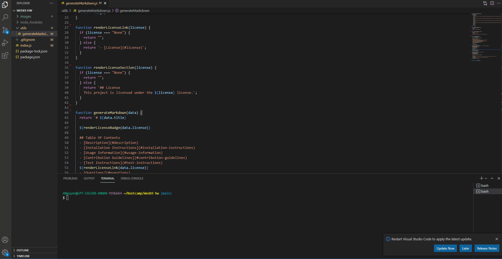

# README Generator

## Table of Contents

- [Description](#description)
- [Installation](#installation)
- [Usage Information](#usage-information)
- [Questions](#questions)

## Description

This generator allows users to create a README file by answering prompts given in the terminal. Once all prompts are answered, users can copy the README file generated and add it to their project.

## Installation

To install necessary dependencies, run the following command(s):

```bash
npm i inquirer
```

## Usage Information

Run Node index.js in the terminal to run the prompts. After all questions are answered a README.md file will be generated.

Below is a gif that will show you how it works.


## Questions

If you have any questions about the repo, please open an issue or contact me directly at n.annabich@gmail.com. You can find more of my work <a href="https://github.com/AnnaNguyen1" target="_blank">here</a>.
